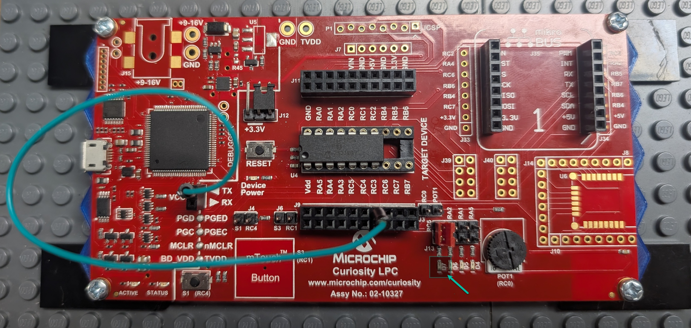
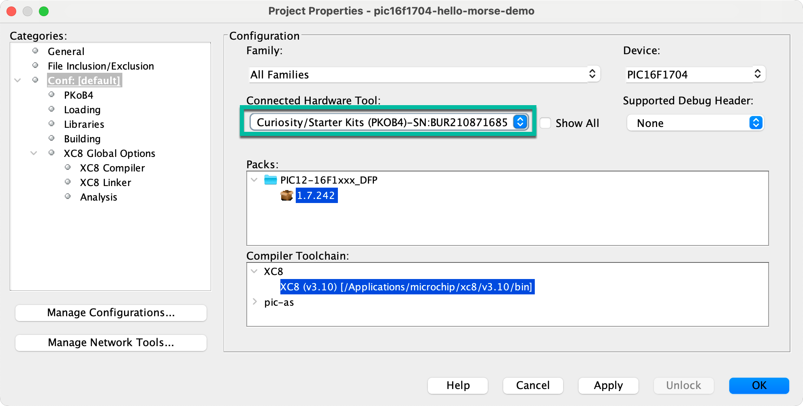
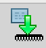
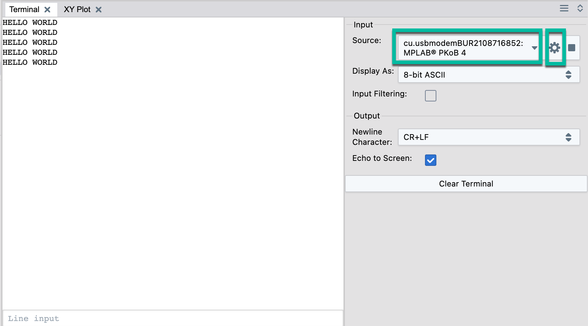
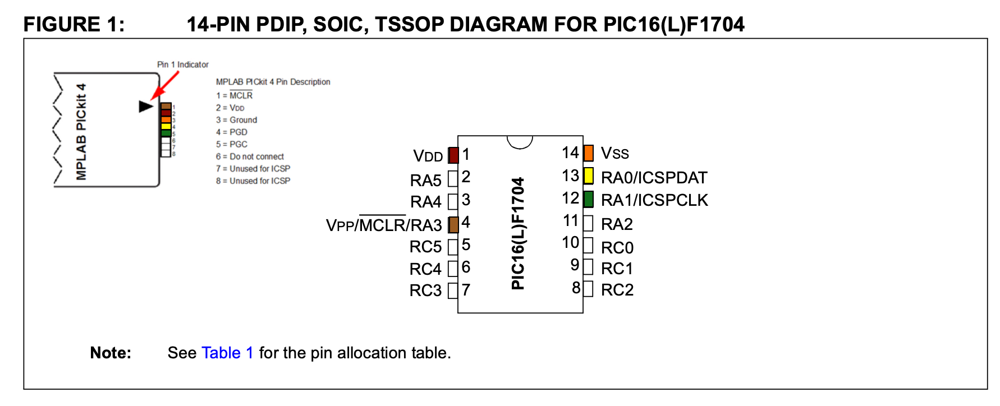
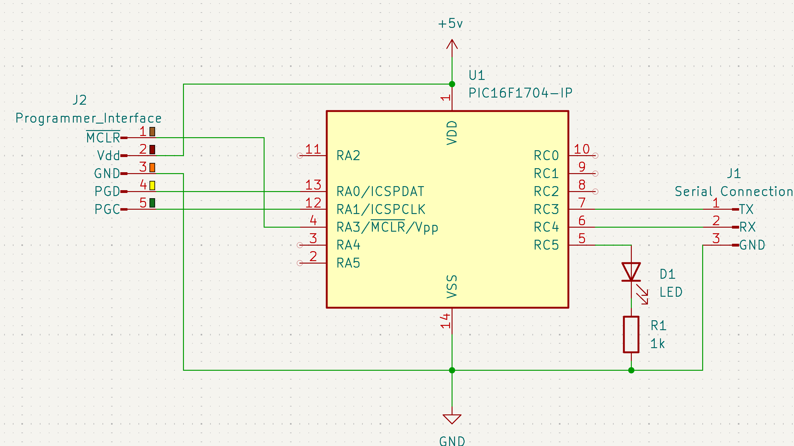
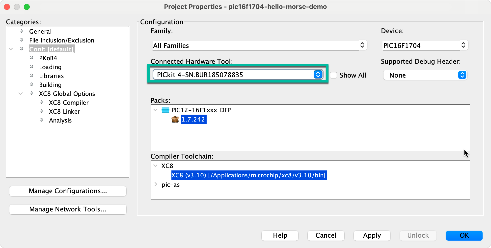
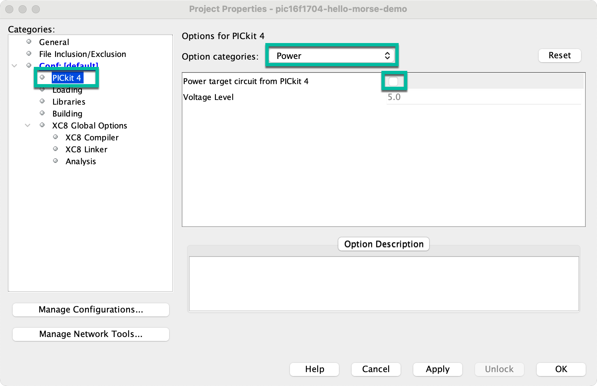
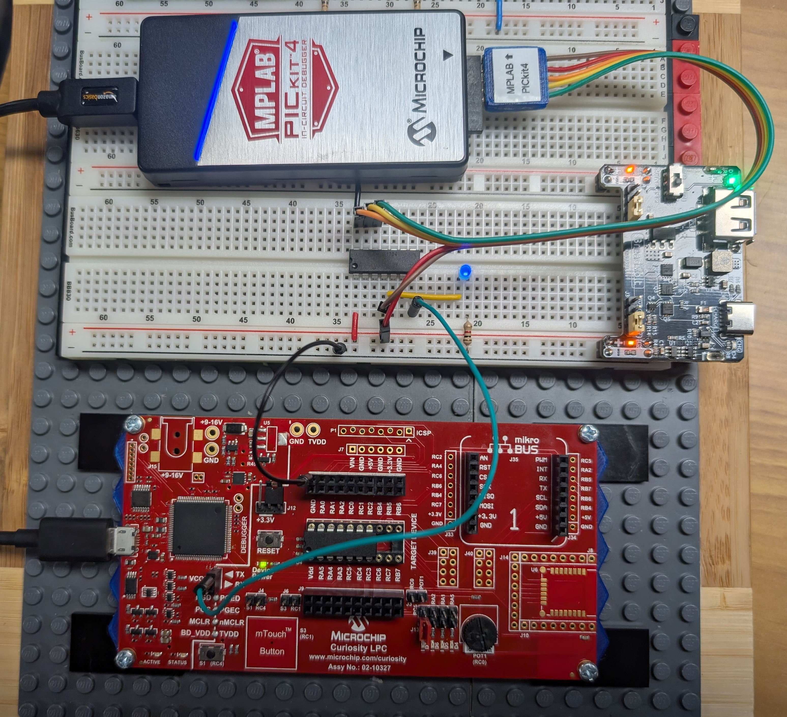

# pic16f1704-hello-morse-demo
## Overview
The purpose of this demo is to provide experience working with the PIC16F1704 microcontroller on both the Curiosity LPC development board as well as a standalone chip on a breadboard. To program the standalone chip we will be using the MPLAB PICkit4 programmer with an external 5v power supply.

The program itself is quite simple. The string literal "HELLO WORLD" is hard-coded. The program enters an infinite loop that first writes the message to the serial UART and then transmits the message on a LED using the International Telecommunication Union (ITU) standard timing for Morse Code. Once the message is complete, it waits the standard interval between words, then repeats. 

The following pins are used for this demo

- pin 5 (RC5): LED 
- pin 6 (RC4): Serial RX (unused)
- pin 7 (RC3): Serial TX

This code was developed using MPLAB X IDE version 6.25. It is important to make certain that the Curiosity LPC application firmware as well as the PICkit 4 application firmware have been updated to the latest versions using MPLAB IPE tool, otherwise there can be connectivity issues when attempting to program the PIC16F1704 devices. 

## Curiosity Board
The image below shows the curiosity LPC board configured to run this demo. The first item to notice is that the PIC16F1704 chip does not use the full 20 pins available on the socket. This is normal and expected. When installing the PIC chip, make certain that pin 1 (the pin beside the dot) is aligned with the Vdd label on the board. 



As mentioned above, the output LED is connected to RC5. If you have removed the 0ohm resistors and installed jumpers, you'll need to ensure you attach the jumper to enable LED_D7.  And finally, connect a jumper wire between RC3 (pin 7) on the microcontroller and the TX pin on the debugger.

### Programming
The first step is to clone this repository into your development environment.

```
git clone https://github.com/lhindman/pic16f1704-hello-morse-demo.git

```

Load the MPLAB X IDE application, then open the pic16f1704-hello-morse-demo.X project from this repository. The device resources and pin mappings are managed using the MPLAB Code Configurator (MCC) and is already configured as stated above. The Curiosity LPC board uses the onboard programmer (PKOB4). Open the **project properties** and make certain it is selected as shown below.



Perform a clean build of the project by holding down the Shift button and pressing F11, or by clicking the clean build icon in the menu bar.


If everything is working correctly, this should returned a ***BUILD SUCCESSFUL*** message in the output terminal.

The final step is to program the device. Click the Production menu and select Make and Program the Device. You can also click the Make and Program Device button in the menu bar.



If this step completes successfully, it should display ***Programming/Verify complete*** in the output terminal.

### Verification
That this point, LED D7 should begin flashing the morse code signal for our message. To verify the serial output, we need to open the Data Visualizer.  Click the Window menu, select the Debugging item, and then select Data Visualizer. In the input section, select the cu.usbmodem device for the MPLAB PKoB4 device, then click the sprocket to configure it for 9600 baud. Finally, click the play button to begin capturing the serial data from the device as shown in the screenshot below.



If you see the words "HELLO WORLD" repeated every few seconds, congratulations, you've sucessfully deployed the demo project to your device. :)

## Standalone Chip
The curiosity development board is great, but the purpose of using these PIC microcontrollers is to integrate them into our electronics projects. Our next step is to build a small PIC16F1704 circuit on a breadboard and then use the MPLAB PICkit4 programmer to load code onto the PIC in circuit.

The image below is adapted from the PIC16F1704 datasheet and the PICkit4 user manual. The color coding corresponds to the programming standard used in the ENDS research lab.

  

In addition to a solderless breadboard and jumper wires, you will need the following components:  

- 1 x PIC16F1704 microcontroller
- 1 x LED
- 1 x 1k ohm resistor
- 1 x MPLAB PICkit4 Programmer
- 1 x 5v power supply

Construct the circuit as shown in the schematic diagram below, including the connections to the PICkit4 Programmer.



### Programming
***The following steps assume you've successfully completed the above programming steps on the Curiosity LPC board.***   

It is theoretically possible to power the PIC chip directly from the PICkit4 device, however the resources I found online strongly discouraged this. The reason is that the USB port struggles to supply sufficient current to program these chips at 5v anyway and any additional circuitry will further reduce the available programming current. Before programming our device, we must reconfigure the project to use the PICkit4 programmer and configure the programmer to NOT attempt to power the target device.

1. Open the project settings and select the PICkit4 device and apply the selection.



2. Open the PICkit4 configuration option, select Power from the dropdown and make certain that *Power target circuit from PICkit 4* is unchecked.



With those options selected, make certain that 5v is applied to the project. Perform a ***Clean Build*** followed by a ***Make and Program Device*** action.

### Verification
Once the programming is complete, the LED should immediately begin flashing the configured message in Morse Code. :)

Capturing the message written to the serial output is a little bit more challenging as the PICkit4 does not provide a USB Modem (virtual comm port) device. To work around this issue, we will utilize the curiosity board. First, connect a GND jumper between the breadboard GND bus and the GND pin on J11 of the curiosity board. Next, connect a jumper between RC3 (pin7) on the standalone PIC device and the TX pin on the VCOM header of the curiosity board. Finally, open the MPLAB Data Visualizer and view the serial messages as we did above. :)

The following photo shows my test configuration, including the serial TX and GND jumpers betweeen the standalone chip and the curiosity board.



## Notes
During my testing I had both the Curiosity LPC board and the PICkit4 programmer connected to my computer simultaneously and I did not have any issues with them conflicting with each other. This allowed me to utilize the virtual comm port on the curiosity board without need to disconnect the PICkit4 programmer.  

For my +5v power source I am using a [BreadVolt Rechargeable Power Supply Module](https://a.co/d/ho2uTfS). I have checked the power waveform on my oscilloscope and while there is some noise, it is significantly better than the vast majority of the 5v power supplies I have tested. It is able to supply 1.5A at 5v and has jumpers to reconfigure it to supply 1.0A at 3.3v instead. It can be charged over USB-C and can supply power over a standard USB-A port. In a lab setting it is far better to use a bench power supply, but in terms of portability, this is fantastic!  


